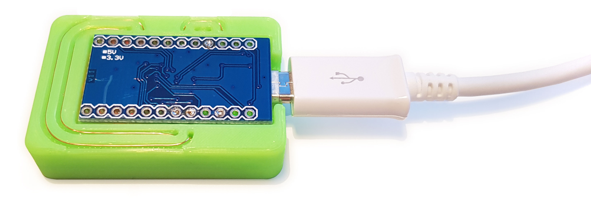

# 3DPCB-Wi-Fi-Ducky
This is a 3D printed Wi-Fi version of the well-known USB Rubber Ducky hacking device (featured in Mr Robot). It is a very powerful PEN test tool that bypasses common security protections since it is planted inside the network (requires some social engineering). I want to raise the awareness of this attack vector and encourage anyone to build it, test it and use it for good to improve security (white hat hacking): https://vonkonow.com/wordpress/3dpcb-wi-fi-ducky/

This implementation uses a 3D printed circuit board that provides the following benefits:
* Quick and easy to build. (takes minutes to assemble)
* Using standard components that can be found at your local supplier. (or in your drawer)
* low cost (< $9) allows you to install several expendable units. (spray and pray) 
* No need to wait for PCB delivery.
* Integrates the structure of the device.
* Compact since it stacks components in 3D. (44x30x11mm)

Credits to [Darren Kitchen @ HAK5](https://shop.hak5.org/products/usb-rubber-ducky-deluxe) for the original USB Rubber Ducky, and [Stefan Kremser/ Spacehuhn](https://github.com/SpacehuhnTech/WiFiDuck#usage) for the WiFi version used in this build: “This is a tool. It’s neither good nor bad. Use it to do good, to study, and to test. Never use it to do harm or create damage!”

For detailed building instructions visit: https://vonkonow.com/wordpress/3dpcb-wi-fi-ducky/
